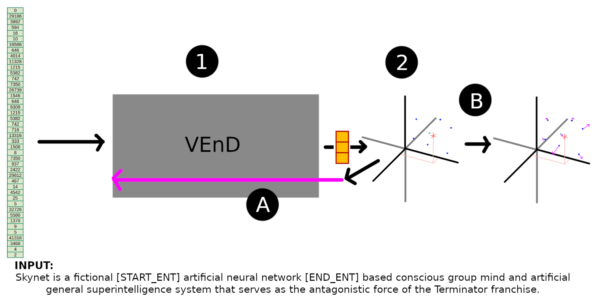

# Named Entity Disambiguation

For my graduate thesis, I investigated the use of Longformer to train an entity embedding.

*The VEnD training pipeline. Using either sorted or randomised data. For a training sample, (1) input the tokens into VEnD; (2) Here, the correct entity is marked in green and incorrect ones are marked in blue; (A) Perform backpropagation using the output from FAISS; (B) Simultaneously modify the embeddings of entities, with the correct entity attracted towards the prediction point at a rate proportional to it’s distance and rt, and incorrect entities repelled from the point at a rate inversely proportional to their distance and proportional to rf*

We achieved similar results to other state-of-the-art models.